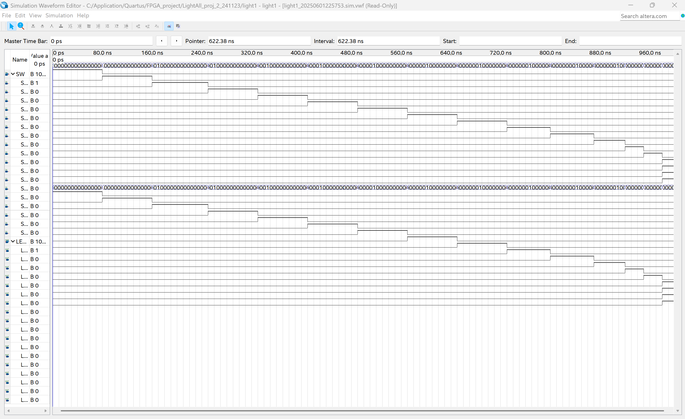

# LightAll_proj_2_241123

使用 **Quartus Prime** 撰寫的 VHDL 設計，實作所有 LED 亮起的控制邏輯。輸入為 18 個開關（SW[0:17]），輸出為 18 個 LED（LEDR[0:17]），實現一對一映射。

<!-- TOC -->
- [LightAll\_proj\_2\_241123](#lightall_proj_2_241123)
  - [📌 專案簡介](#-專案簡介)
  - [🧰 使用工具](#-使用工具)
  - [✨ 功能特色](#-功能特色)
  - [📁 專案結構](#-專案結構)
  - [📸 模擬展示](#-模擬展示)
    - [模擬波形圖](#模擬波形圖)
  - [👨‍💻 作者](#-作者)
<!-- /TOC -->

## 📌 專案簡介

此專案為 FPGA 基礎練習，透過 VHDL 撰寫邏輯，將 18 位開關輸入對應到 18 個 LED 輸出，並透過 FPGA 驗證基本 I/O 操作與資料流架構。

## 🧰 使用工具

- Quartus Prime Lite Edition 18.0
- ModelSim Intel FPGA Edition
- Visual Studio Code
- Git + GitHub

## ✨ 功能特色

- 使用 VHDL 撰寫架構清晰的設計
- 完整實現 SW 到 LEDR 的一對一控制

## 📁 專案結構

```
LightAll_proj_2_241123/
├── light1.vhd               # VHDL 程式設計
├── light1.qpf               # Quartus 專案設定
├── light1.qsf               # 腳位與 I/O 配置
└── README.md                # 專案說明文件
```

## 📸 模擬展示

> - 測試 SW 對應 LED 的輸出同步性
> - 模擬截圖展示開關變化與 LED 反應一致性

### 模擬波形圖



## 👨‍💻 作者

Jeffery – FPGA 初階設計實作練習  
使用 Quatus 撰寫 VHDL 邏輯專案。