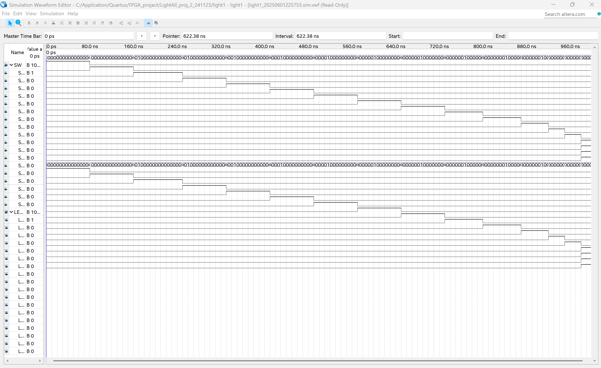

# LightAll_proj_2_241123

VHDL implementation of basic LED control logic. Maps 18 switch inputs (`SW[0:17]`) directly to 18 LED outputs (`LEDR[0:17]`) to practice FPGA GPIO pin assignments and basic data flow architecture.

## Tools Used
- Quartus Prime Lite Edition 18.0
- ModelSim Intel FPGA Edition
- Visual Studio Code

## Project Structure
- `light1.vhd`: VHDL Logic Design
- `light1.qpf` / `.qsf`: Quartus Project & Pin Configurations

## Simulation

*Author: Jeffery*
