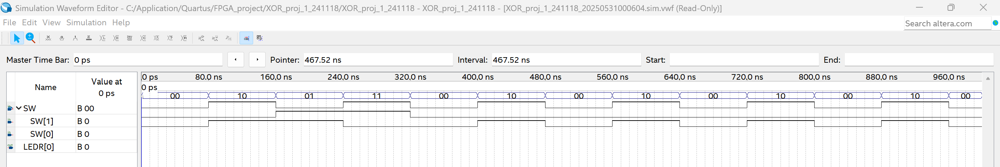

# XOR_proj_1_241118

使用 **Quartus Prime** 設計的 FPGA 專案，實作最基本的 XOR 邏輯功能，並透過圖形化 `.bdf`（Block Diagram File）方式建構邏輯，配合波形檔 `.vwf` 進行模擬驗證。

<!-- TOC -->
- [XOR\_proj\_1\_241118](#xor_proj_1_241118)
  - [📌 專案簡介](#-專案簡介)
  - [🧰 使用工具](#-使用工具)
  - [✨ 功能特色](#-功能特色)
  - [📁 專案結構](#-專案結構)
  - [📸 模擬展示](#-模擬展示)
    - [模擬波形圖](#模擬波形圖)
  - [👨‍💻 作者](#-作者)
<!-- /TOC -->

## 📌 專案簡介

熟悉 FPGA 邏輯設計與 Quartus 圖形化操作流程。透過設計 XOR 閘電路，練習輸入輸出連接、模擬波形建立、電路功能驗證等基本流程。

## 🧰 使用工具

- Quartus Prime Lite Edition 18.0
- ModelSim Intel FPGA Edition
- Visual Studio Code
- Git + GitHub

## ✨ 功能特色

- 使用 Block Diagram `.bdf` 建構 XOR 閘
- 透過 `.vwf` 建立模擬波形輸入驗證邏輯功能

## 📁 專案結構

```
XOR_proj_1_241118/
├── XOR_proj_1_241118.bdf     # Block Diagram 設計
├── Waveform.vwf              # 波形模擬輸入
├── simulation/               # 模擬產物資料夾
├── README.md                 # 專案說明文件
```

## 📸 模擬展示

> - 測試 XOR 真值表（00→0、01→1、10→1、11→0）
> - 模擬環境截圖（ModelSim 或 Quartus 模擬）

### 模擬波形圖



## 👨‍💻 作者

Jeffery – FPGA 初階設計實作練習  
使用 Quatus 撰寫 BDF 專案。
