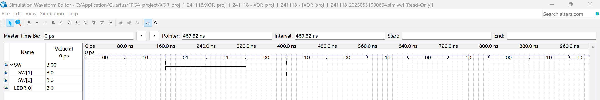

# XOR_proj_1_241118

Implementation of a basic XOR logic gate to verify fundamental logic operations using Quartus Prime Block Diagram File (`.bdf`). Simulated and verified via waveform (`.vwf`).

## Tools Used
- Quartus Prime Lite Edition 18.0
- ModelSim Intel FPGA Edition
- Visual Studio Code

## Project Structure
- `XOR_proj_1_241118.bdf`: Block Diagram Design
- `Waveform.vwf`: Simulation Waveform Input

## Simulation

*Author: Jeffery*
